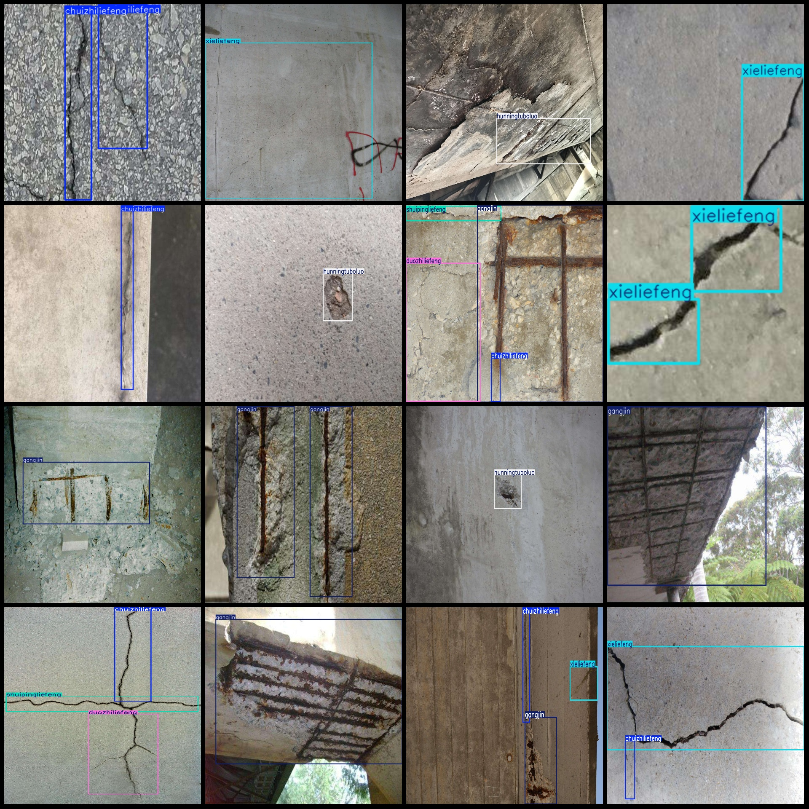
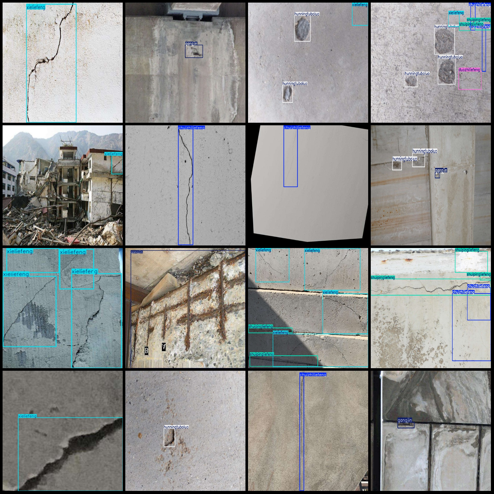

# Voice of Concrete and Bridge Diagnostics (VOC+YOLO) Dataset for 3761 Images in 6 Classes

Dataset format: Pascal VOC format+YOLO format (without split path in txtfile, only containing jpg image and corresponding VOC format xmlfile and yolo format txtfile)
The number of jpg files is 3761.
annotation count: 3761  
annotation count: 3761  
It seems there might have been a misunderstanding. If you need help with anything else, feel free to ask.
The categories are labeled as follows: ["chuizhiliefeng", "duozhiliefeng", "gangjin", "hunningtuboluo", "shuipingliefeng", "xieliefeng"]
["Vertical crack", "Multi-branch crack", "Rebar", "Cement spalling", "Horizontal crack", "Slant crack"]
The number of boxes labeled in each category:
chuizhiliefeng box count = 1201  
"duozhiliefeng" box count = 581
gangjin box count = 2130  
hunningtuboluo box count = 839  
shuipingliefeng box count = 1241  
"xieliefeng box count = 1731"
Total Frames: 7723
images per class:   
chuizhiliefeng images = 823  
The number of images owned by duozhiliefeng is 496.
gangjin images = 1248  
hunningtuboluo images = 570  
Shuipingliefeng has 942 photos.
xieliefeng images = 1208  
Image resolution: Multi-resolution images, such as 1920x1440, 660x495, etc.
LabelImg is a powerful tool for image annotation and analysis. It allows you to label images with text, shapes, or other objects, and then analyze the data in various ways. Here are some examples of how you can use LabelImg:

1. Image Annotation: Use LabelImg to automatically label images with text, shapes, or other objects. This can be useful for tasks like object detection, where you want to identify specific objects in an image.

2. Data Analysis: After labeling images, you can use LabelImg to perform various data analysis tasks on the labeled data. For example, you can calculate the number of instances of each label, count the occurrences of different objects, or perform other statistical analyses.

3. Visualization: LabelImg provides several visualization options that allow you to explore the data in more detail. For example, you can create heatmaps to visualize the distribution of labels, or create bar charts to summarize the data.

4. Interactive Exploration: LabelImg also supports interactive exploration, allowing you to view and interact with the data in real-time. This can be useful when analyzing large datasets or when you need to quickly make decisions based on the data.

Overall, LabelImg is a powerful tool for image annotation and analysis, and can help you gain insights into your data and improve your analysis workflow.
Annotation rule: Draw a rectangle around the class.
Important note: The dataset does not have a separate training, validation, and test set.
This dataset does not guarantee the accuracy of the trained models or weights file.
Image Preview:
## Images

Here is a pay link on Stripe ( https://buy.stripe.com/3cs8yP7sY87d0vu9AB ). Please contact me lonlonago@foxmail.com after funding $89, and I will send you a complete data files , thank you!

